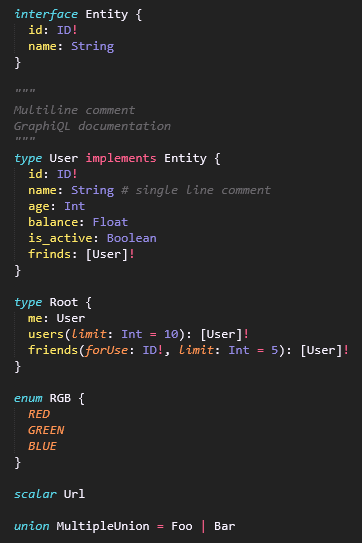

# GraphQL Language Definition for SublimeText 3

**This package supports Sublime Text 3 v3092+**

GraphQL language definition for SublimeText with support for block strings
(multi-line comments/documentation)

Forked from [dncrews/GraphQL-SublimeText3](https://github.com/dncrews/GraphQL-SublimeText3)
this package has support for triple quotes (""") block strings as per
[GraphQL RFC](https://facebook.github.io/graphql/draft/#sec-String-Value) and
its [implementation](https://github.com/facebook/graphql/pull/327).

A [PR was created](https://github.com/dncrews/GraphQL-SublimeText3/pull/6) on
the original project but seems like the project is not being maintained.

## Installation and Use

1. [Install Package Control](https://sublime.wbond.net/installation)
2. `Package Control: Install Package` => `GraphQL Syntax`

